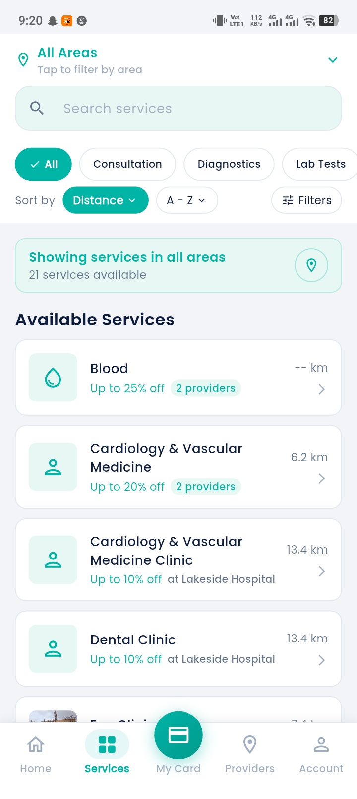
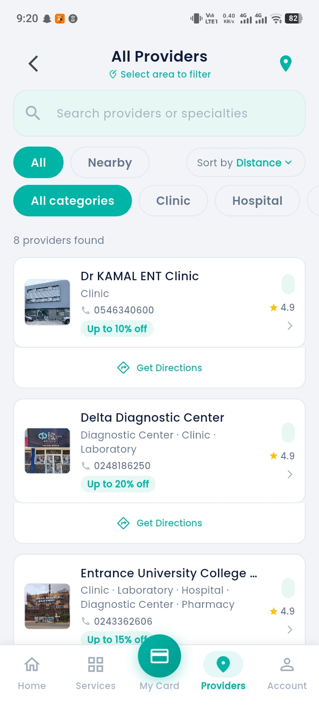
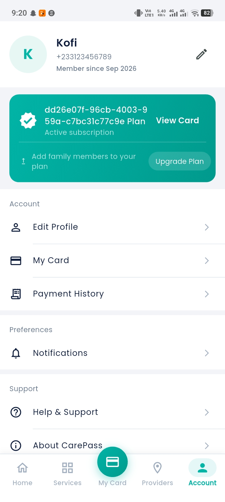
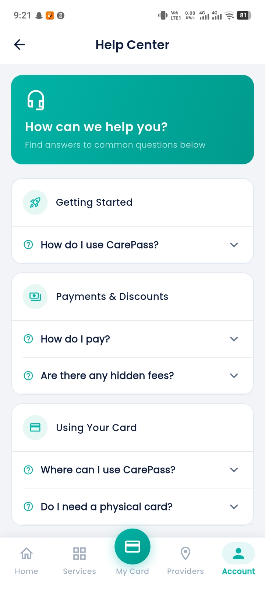

<p align="center">
  
</p>

<h1 align="center">CarePass</h1>
<p align="center"><strong>Quality Care for Less</strong></p>
<p align="center">Discover healthcare providers, compare service discounts, and manage your healthcare membership in Ghana.</p>
<p align="center">Flutter · Dart · Firebase · BLoC · expressPay</p>

---

CarePass brings healthcare discovery and membership management into one mobile app. Users can browse clinics, hospitals, pharmacies, laboratories, and diagnostic centers; explore available services; and access their digital membership card.

This repository contains the Flutter app and its Firebase Cloud Functions backend. The administration dashboard is maintained separately.

## App preview

<table>
  <tr><th>Home</th><th>Services</th><th>Providers</th></tr>
  <tr>
    <td></td>
    <td></td>
    <td></td>
  </tr>
</table>

<table>
  <tr><th>Account</th><th>Help Center</th></tr>
  <tr>
    <td></td>
    <td></td>
  </tr>
</table>

Screenshots show an example app session. Provider availability, discounts, and membership details depend on the configured backend.

## Features

| Area | What it offers |
| --- | --- |
| Home | Promotional banners, popular services, provider discovery, and WhatsApp support access. |
| Services | Search, category and area filters, and comparison of the same service across providers. |
| Providers | Search by provider or specialty, multiple categories per provider, nearby filtering, sorting, contact details, and map directions. |
| Membership | Digital membership card, subscription status, family member management, and blood pressure/blood sugar check allowances. |
| Payments | Hosted expressPay checkout, server-side payment verification, payment history, and discount codes. |
| Account | Phone OTP sign-in, profile management, notifications, FAQs, and support. |
| Health assistant | A Gemini-backed assistant feature with requests handled through Cloud Functions. |

Provider contact actions open the phone or maps app. They do not represent confirmed appointment reservations.

## Technology

| Layer | Tools |
| --- | --- |
| App | Flutter and Dart, Material UI, Google Fonts |
| State and navigation | `flutter_bloc`, `equatable`, `go_router` |
| Dependency injection | `get_it` |
| Backend | Firebase Authentication, Cloud Firestore, Cloud Functions |
| Notifications | Firebase Cloud Messaging and local notifications |
| Location and media | Geolocator, geocoding, cached network images, URL launcher |
| Checkout | expressPay hosted checkout in a WebView |
| Server runtime | Node.js 22, Firebase Admin SDK |

Android screenshots are included above. The repository also contains iOS, web, and desktop platform folders; Firebase configuration and plugin behavior must be validated for each target before release.

## Getting started

### Requirements

- Flutter with a Dart SDK compatible with `^3.11.5`, as declared in [pubspec.yaml](pubspec.yaml).
- Android Studio/Android SDK and an emulator or physical Android device. iOS development requires macOS and Xcode.
- Node.js 22 and npm for the backend.
- Firebase CLI and FlutterFire CLI, with access to a development Firebase project.
- Java 21 or newer for the Firestore emulator tests.

### 1. Get the code and dependencies

```sh
git clone https://github.com/fadymilad2/carepass.git
cd carepass
flutter pub get
npm ci --prefix functions
```

### 2. Configure Firebase

The checked-in Firebase project mapping belongs to the original CarePass environment. For your own environment, select your development project and generate matching platform configuration:

```sh
firebase login
firebase use --add
flutterfire configure --project=YOUR_FIREBASE_PROJECT_ID
```

`lib/main.dart` imports the generated `lib/firebase_options.dart`; this file is intentionally ignored by Git. Configure the platforms you intend to run, including their native Firebase files.

Enable Phone authentication and configure app verification for your platform. The app also needs its Firestore data, rules, indexes, and deployed Cloud Functions. Review [firestore.rules](firestore.rules), [firestore.indexes.json](firestore.indexes.json), and [firebase.json](firebase.json) for the shared backend configuration. A fresh Firebase project does not include the provider catalog or membership plans.

### 3. Configure backend integrations

Store integration credentials in Firebase Functions secrets, never in Dart code or committed configuration files.

| Setting | Purpose |
| --- | --- |
| `EXPRESSPAY_MERCHANT_ID` | expressPay merchant credentials |
| `EXPRESSPAY_API_KEY` | expressPay API credentials |
| `EXPRESSPAY_ENVIRONMENT` | Selects `sandbox` or `live`; defaults to sandbox |
| `EXPRESSPAY_SANDBOX_UIDS` | Allowlist of Firebase user IDs permitted to use sandbox checkout |
| `GEMINI_API_KEY` | Health assistant backend |
| `GOOGLE_MAPS_API_KEY` | Backend map-link resolution |
| `PAYSTACK_SECRET_KEY` | Legacy Paystack endpoints retained for older clients and pending orders |

The first two expressPay values and the API keys are secrets. `EXPRESSPAY_ENVIRONMENT` and `EXPRESSPAY_SANDBOX_UIDS` are Functions configuration parameters.

The current Flutter checkout uses expressPay. Follow [expressPay setup](docs/expresspay-setup.md) for secret configuration, sandbox access, callback endpoints, testing, and deployment. Sandbox checkout requires an allowed test account and configured credentials. The guide contains the original project's IDs and URLs; substitute your development environment when following it for a different project.

### 4. Run the app

```sh
flutter devices
flutter run
```

For Firebase test phone numbers configured in your project, the debug build supports this explicit opt-in:

```sh
flutter run --dart-define=FIREBASE_TEST_PHONE_AUTH=true
```

Use this flag only with configured test phone numbers. Normal sign-in uses Firebase app verification.

## Project structure

```text
lib/
  main.dart                  App startup and top-level providers
  core/
    constants/               Shared constants and strings
    di/                      Dependency registration
    notifications/           Push and local notification handling
    router/                  Routes and bottom navigation shell
    theme/                   Colors, typography, and spacing
    utils/                   Shared helpers
    widgets/                 Reusable UI components
  features/
    account/                 Profile, history, notifications, and support
    ai_assistant/            Health assistant
    auth/                    Phone sign-in and onboarding
    card/                    Membership card and health checks
    home/                    Home feed and discovery
    payment/                 Plans, checkout, and family members
    providers/               Provider directory and details
    services/                Service catalog and comparisons
functions/
  index.js                   Cloud Functions entry point
  src/                       Payments, AI, maps, notifications, health checks
  test/                      Backend and Firestore rules tests
test/                        Flutter unit and regression tests
docs/                        Setup notes, reviews, and screenshots
```

Features follow a layered structure: `data` contains data sources, models, and repository implementations; `domain` contains entities, repository contracts, and use cases; `presentation` contains BLoCs, pages, and widgets.

Some page-specific widgets and BLoC event/state files use Dart `part` directives. Import their owning page or BLoC entry point rather than importing the part file directly.

## Testing

Run these commands from the repository root:

```sh
# Flutter analysis and tests
flutter analyze
flutter test

# Backend payment tests
npm test --prefix functions

# Firestore rules tests against an isolated demo emulator
npx -y firebase-tools@latest emulators:exec --only firestore --project demo-carepass --config firebase.test.json "node --test functions/test/firestore.rules.test.js"
```

The emulator command uses a demo project. Keep automated rules tests separate from the production database. Payment unit tests mock gateway responses; real sandbox checkout is covered by the [integration test steps](docs/expresspay-setup.md#test-on-a-device).

## Android build

```sh
flutter build apk --debug
```

The APK is generated at `build/app/outputs/flutter-apk/app-debug.apk`.

Before publishing a release, configure your application ID and production signing. The current Android release build configuration uses the debug signing configuration. Validate phone authentication, notification permissions, location access, and payment callbacks on a device using the intended backend environment.

## Further documentation

- [expressPay setup and rollout](docs/expresspay-setup.md)
- [Refactor review and verification notes](docs/refactor-review.md)
- [Provider permissions fix](docs/providers-permission-fix.md)

## License

No license file is currently included. Contact the repository owner for permission before redistributing the project.
